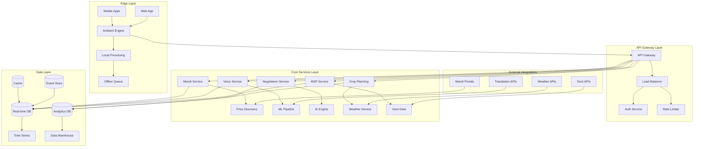

# Design Document: MANDI EAR™

## Overview

MANDI EAR™ is a comprehensive agricultural intelligence platform that leverages ambient AI, multilingual processing, and real-time data analytics to transform India's agricultural market ecosystem. The system architecture is designed around three core pillars: **Ambient Intelligence** (passive audio processing), **Multilingual Accessibility** (50+ Indian languages), and **Real-time Market Intelligence** (national price discovery and optimization).

The platform operates as a distributed system with edge computing capabilities for real-time audio processing, cloud-based analytics for market intelligence, and mobile-first interfaces optimized for rural connectivity patterns. The architecture supports both online and offline modes, ensuring accessibility across India's diverse digital infrastructure landscape.

## Architecture

### High-Level System Architecture



### Microservices Architecture

The system follows a microservices pattern with the following core services:

1. **Ambient AI Service**: Real-time audio processing and conversation extraction
2. **Voice Processing Service**: Multilingual ASR/TTS and NLP processing
3. **Price Discovery Service**: Market data aggregation and real-time price intelligence
4. **Negotiation Intelligence Service**: AI-powered negotiation guidance and strategy
5. **Crop Planning Service**: Predictive analytics for crop recommendations
6. **MSP Enforcement Service**: Government price monitoring and compliance
7. **Anti-Hoarding Detection Service**: Market manipulation detection and alerts
8. **User Management Service**: Authentication, profiles, and preferences
9. **Notification Service**: Real-time alerts and communication
10. **Analytics Service**: Business intelligence and reporting

## Components and Interfaces

### Ambient AI Engine

**Purpose**: Processes ambient audio to extract market intelligence from natural conversations.

**Core Components**:
- **Audio Capture Module**: Continuous audio streaming with noise filtering
- **Speech Segmentation**: Identifies speaker boundaries and conversation segments
- **Intent Classification**: Determines buying/selling intent and urgency levels
- **Entity Extraction**: Extracts commodity, price, quantity, location, and quality data
- **Confidence Scoring**: Assigns reliability scores to extracted information

**Key Interfaces**:
```typescript
interface AmbientProcessor {
  processAudioStream(stream: AudioStream): Promise<MarketIntelligence[]>
  extractPriceData(segment: AudioSegment): Promise<PricePoint>
  classifyIntent(text: string, context: ConversationContext): Intent
  scoreConfidence(extraction: DataExtraction): ConfidenceScore
}

interface MarketIntelligence {
  commodity: string
  price: number
  quantity: number
  location: GeoLocation
  timestamp: Date
  confidence: number
  speakerIntent: 'buying' | 'selling' | 'inquiry'
  urgency: 'low' | 'medium' | 'high'
}
```

### Multilingual Voice Interface

**Purpose**: Provides seamless voice interaction in 50+ Indian languages with cultural context awareness.

**Core Components**:
- **Language Detection**: Automatic identification of spoken language and dialect
- **ASR Engine**: Speech-to-text conversion optimized for Indian languages
- **NLP Processor**: Intent understanding and entity extraction in regional languages
- **TTS Engine**: Natural-sounding text-to-speech synthesis
- **Context Manager**: Maintains conversation state and cultural context

**Key Interfaces**:
```typescript
interface VoiceInterface {
  detectLanguage(audio: AudioBuffer): Promise<LanguageCode>
  transcribeAudio(audio: AudioBuffer, language: LanguageCode): Promise<string>
  processNaturalLanguage(text: string, context: UserContext): Promise<Intent>
  synthesizeSpeech(text: string, language: LanguageCode): Promise<AudioBuffer>
  maintainContext(sessionId: string, interaction: Interaction): void
}

interface UserContext {
  preferredLanguage: LanguageCode
  location: GeoLocation
  farmerProfile: FarmerProfile
  conversationHistory: Interaction[]
  culturalPreferences: CulturalContext
}
```

### Price Discovery System

**Purpose**: Aggregates and processes real-time price data from multiple sources to provide comprehensive market intelligence.

**Core Components**:
- **Data Ingestion Pipeline**: Multi-source data collection and normalization
- **Price Validation Engine**: Data quality checks and anomaly detection
- **Market Analytics**: Price trend analysis and prediction models
- **Cross-Mandi Comparison**: Regional price analysis and arbitrage opportunities
- **Real-time Streaming**: Live price updates and change notifications

**Key Interfaces**:
```typescript
interface PriceDiscoverySystem {
  ingestPriceData(source: DataSource, data: RawPriceData[]): Promise<void>
  validatePricePoint(price: PricePoint): ValidationResult
  analyzeTrends(commodity: string, timeRange: TimeRange): TrendAnalysis
  findArbitrageOpportunities(location: GeoLocation, commodity: string): ArbitrageOpportunity[]
  streamPriceUpdates(subscription: PriceSubscription): Observable<PriceUpdate>
}

interface PricePoint {
  commodity: string
  price: number
  quantity: number
  quality: QualityGrade
  mandi: MandiInfo
  timestamp: Date
  source: DataSource
  reliability: number
}
```

### Negotiation Copilot

**Purpose**: Provides real-time negotiation assistance based on market conditions, buyer behavior, and historical data.

**Core Components**:
- **Market Context Analyzer**: Real-time market condition assessment
- **Buyer Intent Detector**: Analysis of buyer behavior and negotiation patterns
- **Strategy Generator**: AI-powered negotiation strategy recommendations
- **Outcome Predictor**: Success probability estimation for different approaches
- **Learning Engine**: Continuous improvement from negotiation outcomes

**Key Interfaces**:
```typescript
interface NegotiationCopilot {
  analyzeMarketContext(commodity: string, location: GeoLocation): MarketContext
  detectBuyerIntent(conversation: ConversationData): BuyerIntent
  generateStrategy(context: NegotiationContext): NegotiationStrategy
  predictOutcome(strategy: NegotiationStrategy, context: NegotiationContext): OutcomePrediction
  learnFromOutcome(negotiation: NegotiationSession, outcome: NegotiationOutcome): void
}

interface NegotiationStrategy {
  recommendedPrice: number
  priceRange: PriceRange
  tactics: NegotiationTactic[]
  timing: TimingRecommendation
  alternatives: AlternativeOption[]
  confidence: number
}
```

### Crop Planning Engine

**Purpose**: Provides AI-powered crop planning recommendations based on comprehensive data analysis.

**Core Components**:
- **Weather Integration**: Long-term weather forecasting and climate analysis
- **Soil Analysis**: Soil condition assessment and suitability mapping
- **Demand Forecasting**: Market demand prediction and trend analysis
- **Risk Assessment**: Comprehensive risk evaluation and mitigation strategies
- **Income Optimization**: Profit maximization through optimal crop selection

**Key Interfaces**:
```typescript
interface CropPlanningEngine {
  analyzeWeatherPatterns(location: GeoLocation, timeframe: TimeFrame): WeatherAnalysis
  assessSoilConditions(farmLocation: GeoLocation): SoilAssessment
  forecastDemand(commodity: string, timeframe: TimeFrame): DemandForecast
  evaluateRisks(cropPlan: CropPlan): RiskAssessment
  optimizeIncome(constraints: FarmConstraints): CropRecommendation[]
}

interface CropRecommendation {
  crop: CropType
  variety: string
  plantingWindow: DateRange
  expectedYield: number
  projectedIncome: number
  riskLevel: RiskLevel
  waterRequirement: number
  inputCosts: CostBreakdown
  marketOutlook: MarketOutlook
}
```

## Data Models

### Core Domain Models

```typescript
// User and Farm Models
interface Farmer {
  id: string
  name: string
  phoneNumber: string
  preferredLanguage: LanguageCode
  location: GeoLocation
  farms: Farm[]
  profile: FarmerProfile
  preferences: UserPreferences
}

interface Farm {
  id: string
  farmerId: string
  location: GeoLocation
  area: number
  soilType: SoilType
  irrigationType: IrrigationType
  crops: CropHistory[]
  equipment: Equipment[]
}

// Market Data Models
interface MandiInfo {
  id: string
  name: string
  location: GeoLocation
  operatingHours: TimeRange
  facilities: Facility[]
  averageVolume: number
  reliability: number
}

interface PriceData {
  id: string
  commodity: string
  price: number
  quantity: number
  quality: QualityGrade
  mandi: MandiInfo
  timestamp: Date
  source: DataSource
  confidence: number
  trends: PriceTrend[]
}

// AI Processing Models
interface ConversationData {
  id: string
  audioSegments: AudioSegment[]
  transcription: string
  language: LanguageCode
  participants: Speaker[]
  extractedData: MarketIntelligence[]
  confidence: number
}

interface AudioSegment {
  id: string
  startTime: number
  endTime: number
  speaker: Speaker
  audioData: AudioBuffer
  transcription: string
  entities: ExtractedEntity[]
}

// Planning and Analytics Models
interface CropPlan {
  id: string
  farmerId: string
  season: Season
  crops: PlannedCrop[]
  totalInvestment: number
  projectedRevenue: number
  riskFactors: RiskFactor[]
  recommendations: Recommendation[]
}

interface MarketAnalytics {
  commodity: string
  region: string
  priceHistory: PricePoint[]
  trends: TrendAnalysis
  seasonalPatterns: SeasonalPattern[]
  demandForecast: DemandForecast
  supplyAnalysis: SupplyAnalysis
}
```

### Data Storage Strategy

**Time-Series Database (InfluxDB)**:
- Real-time price data
- Audio processing metrics
- User interaction patterns
- Market trend data

**Document Database (MongoDB)**:
- User profiles and preferences
- Conversation transcriptions
- Crop planning data
- Market intelligence reports

**Relational Database (PostgreSQL)**:
- Master data (mandis, commodities, regions)
- User authentication and authorization
- Transaction records
- System configuration

**Cache Layer (Redis)**:
- Frequently accessed price data
- User session data
- Real-time notifications
- API response caching

## Error Handling

### Ambient AI Processing Errors

**Audio Quality Issues**:
- Implement noise reduction and audio enhancement
- Provide confidence scores for all extractions
- Fallback to manual input when confidence is below threshold
- Graceful degradation with partial data extraction

**Language Detection Failures**:
- Multi-model language detection with voting mechanism
- User confirmation for uncertain language detection
- Fallback to most common regional language
- Learning from user corrections

**Entity Extraction Errors**:
- Multiple extraction models with consensus scoring
- Context-aware validation using market knowledge
- User feedback integration for continuous improvement
- Confidence-based filtering of uncertain extractions

### Voice Interface Errors

**ASR Failures**:
- Multiple ASR engines with fallback hierarchy
- Noise-robust models for rural environments
- User repetition prompts for unclear audio
- Text input fallback for voice failures

**TTS Quality Issues**:
- Multiple voice synthesis engines per language
- Quality monitoring and automatic engine switching
- User preference learning for voice characteristics
- Fallback to text display when TTS fails

### Data Processing Errors

**Price Data Anomalies**:
- Statistical outlier detection and flagging
- Multi-source validation for price points
- Historical trend validation
- Manual review queue for suspicious data

**Network Connectivity Issues**:
- Offline mode with local data caching
- Progressive data synchronization
- Priority-based data transmission
- Graceful degradation of features

### System Resilience

**Service Failures**:
- Circuit breaker pattern for external services
- Automatic failover to backup services
- Graceful service degradation
- Real-time health monitoring and alerting

**Data Consistency**:
- Event sourcing for critical data changes
- Eventual consistency with conflict resolution
- Data validation at multiple layers
- Automated data quality monitoring

## Testing Strategy

### Dual Testing Approach

The testing strategy combines comprehensive unit testing for specific functionality with property-based testing for universal correctness properties. This dual approach ensures both concrete bug detection and general system correctness validation.

**Unit Testing Focus**:
- Specific examples demonstrating correct behavior
- Edge cases and error conditions
- Integration points between components
- Language-specific processing accuracy
- Audio processing quality validation

**Property-Based Testing Focus**:
- Universal properties across all inputs
- Data consistency and integrity
- System behavior under various conditions
- Performance characteristics
- Security and privacy compliance

### Property-Based Testing Configuration

All property-based tests will use **Hypothesis** (Python) or **fast-check** (TypeScript) libraries with minimum 100 iterations per test. Each test will be tagged with references to design document properties using the format:

**Feature: mandi-ear, Property {number}: {property_text}**

### Testing Infrastructure

**Automated Testing Pipeline**:
- Continuous integration with comprehensive test suites
- Performance testing with realistic data volumes
- Security testing for data privacy and protection
- Multilingual testing across all supported languages
- Real-world audio sample testing for ambient AI

**Quality Assurance**:
- User acceptance testing with actual farmers
- Accessibility testing for rural users
- Network condition simulation testing
- Cross-platform compatibility validation
- Data accuracy validation against known sources

## Correctness Properties

*A property is a characteristic or behavior that should hold true across all valid executions of a system—essentially, a formal statement about what the system should do. Properties serve as the bridge between human-readable specifications and machine-verifiable correctness guarantees.*

### Property 1: Ambient AI Extraction Accuracy
*For any* ambient audio containing agricultural price discussions, the Ambient_AI_Engine should extract commodity, price, quantity, location data and speaker intent with accuracy above the specified thresholds (85% for normal conditions, 75% for high noise)
**Validates: Requirements 1.1, 1.2, 1.5**

### Property 2: Price Aggregation Correctness
*For any* set of price points for the same commodity, the weighted average calculation should correctly factor quantity and recency according to the mathematical formula
**Validates: Requirements 1.3**

### Property 3: Data Processing Timeliness
*For any* incoming data stream, processing and metadata assignment (timestamps, geo-tags) should complete within the specified time limits (30 seconds for ambient data, 3 seconds for voice queries)
**Validates: Requirements 1.4, 2.2**

### Property 4: Multilingual Processing Consistency
*For any* supported Indian language, voice input processing and output generation should work correctly with appropriate localization (currency, units, cultural context)
**Validates: Requirements 2.1, 2.3**

### Property 5: Language Detection Fallback
*For any* uncertain language detection scenario, the system should request clarification in the most likely detected language and maintain conversation context
**Validates: Requirements 2.4, 2.5**

### Property 6: Cross-Mandi Data Completeness
*For any* commodity price query, the system should return data from all required regions (28 states, 8 union territories) with minimum result counts and complete financial calculations
**Validates: Requirements 3.1, 3.2, 3.3**

### Property 7: Data Update Frequency Compliance
*For any* market operating period, price updates should occur within specified intervals (15 minutes) with appropriate fallback when data is unavailable
**Validates: Requirements 3.4, 3.5**

### Property 8: Negotiation Guidance Completeness
*For any* negotiation context, the system should provide benchmarks, counter-offer suggestions, and strategic recommendations within time limits
**Validates: Requirements 4.1, 4.2, 4.3, 4.5**

### Property 9: Learning System Improvement
*For any* negotiation outcome, the system should correctly incorporate feedback to improve future recommendations
**Validates: Requirements 4.4**

### Property 10: Crop Planning Comprehensiveness
*For any* planning request, the Crop_Planning_Engine should analyze all required data sources (weather, soil, demand, historical trends) and provide complete recommendations with income projections and risk assessments
**Validates: Requirements 5.1, 5.2**

### Property 11: Seasonal and Resource Optimization
*For any* planning scenario with constraints (festivals, water availability, export demand), the system should correctly factor these constraints into crop recommendations
**Validates: Requirements 5.3, 5.4, 5.5**

### Property 12: Continuous Price Monitoring
*For any* commodity with MSP rates, the system should continuously compare market prices against official rates and maintain current government data
**Validates: Requirements 6.1, 6.3**

### Property 13: Alternative Suggestion System
*For any* scenario where prices fall below thresholds (MSP, farmer floors) or manipulation is detected, the system should provide immediate alerts and suggest viable alternatives
**Validates: Requirements 6.2, 7.2, 8.4**

### Property 14: Compliance Reporting
*For any* detected violation (MSP, hoarding), the system should generate complete reports with evidence for regulatory authorities
**Validates: Requirements 6.4, 7.4**

### Property 15: Location Information Accuracy
*For any* government procurement center or alternative market, the system should provide accurate directions and current contact information
**Validates: Requirements 6.5**

### Property 16: Anomaly Detection Accuracy
*For any* price series, the Anti_Hoarding_Detector should correctly identify statistical anomalies (>25% deviation from 30-day moving average) and abnormal stockpiling patterns
**Validates: Requirements 7.1, 7.3**

### Property 17: Supply-Demand Balance Calculation
*For any* commodity and region combination, the system should provide accurate supply-demand balance indicators
**Validates: Requirements 7.5**

### Property 18: Farmer Benchmarking System
*For any* farmer's price conversations and performance data, the system should build accurate historical benchmarks and track performance against local and regional standards
**Validates: Requirements 8.1, 8.2, 8.3**

### Property 19: Performance Analytics Accuracy
*For any* farmer's historical data, the system should calculate correct income improvement metrics over time
**Validates: Requirements 8.5**

### Property 20: Alert System Customization
*For any* user-defined alert thresholds and significant market events (>10% price changes, weather emergencies), the system should send appropriate notifications with actionable recommendations
**Validates: Requirements 9.2, 9.3, 9.4**

### Property 21: Cross-Platform Consistency
*For any* feature available on the platform, functionality should work identically across web browsers and mobile applications (Android/iOS)
**Validates: Requirements 10.1**

### Property 22: Offline Mode Functionality
*For any* cached data and basic queries, the system should provide access when internet connectivity is unavailable
**Validates: Requirements 10.2**

### Property 23: Network Optimization
*For any* poor connectivity scenario, the system should prioritize essential information and optimize data usage
**Validates: Requirements 10.3**

### Property 24: User Experience Features
*For any* new user or accessibility need, the system should provide functional tutorials and accessibility features (screen readers, high-contrast modes)
**Validates: Requirements 10.4, 10.5**